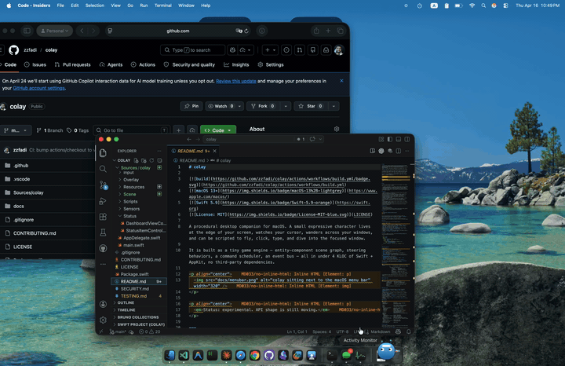

# colay

[](https://github.com/zzfadi/colay/actions/workflows/build.yml)
[](https://www.apple.com/macos/)
[](https://swift.org)
[](LICENSE)

A procedural desktop companion for macOS. A small expressive character lives at the edge of your screen, watches your cursor, wanders across your windows, and can be scripted to fly, click, type, and dive into the focused window.

It is built as a tiny game engine — entity-component scene graph, steering behaviors, a command scheduler, an event bus — all in under 4 KLOC of Swift + AppKit, no third-party dependencies.

<p align="center">
  
</p>

<p align="center">
  <em>Status: experimental. API shape is still moving.</em>
</p>

---

## Why

I wanted a real substrate to experiment with on-screen agents. Most "desktop pets" are one-off scripts; I wanted:

- a **proper scene graph** so I can add new visuals without rewriting anything
- **physics-based motion** so movement reads as alive rather than tween'd
- a **command surface** that is cleanly introspectable — the same JSON schema a human types by hand is the one an LLM tool-caller will eventually target
- **observability baked in** — a live log panel in the menu bar so you can see what the agent just did

## Features

- **Menu-bar overlay** — a transparent, click-through, always-on-top window renders the character across every space.
- **Character animation** — procedural breathing, blinking, saccading eyes that track the cursor, a warp/stretch mode used by the dive effect.
- **Steering behaviors** — arrive / seek / wander / follow-cursor / stay-on-screen, composable via a weighted behavior stack (Reynolds 1999).
- **Command scheduler** — sequences and parallel composites, pause, slow-motion, per-command cancel.
- **Dashboard popover** — dark programmatic UI with live telemetry, behavior pills, action tiles, a live log, engine controls, script loader.
- **Dive / emerge** — the character can dive into the focused window (attaching to it) and emerge back out, with a mirrored genie-in-a-bottle effect.
- **JSON scripts** — load a script from disk, loop or one-shot, runs against the same command registry as the UI.
- **AX sensors** — debounced focused-window tracking using Accessibility APIs, delivered via an event bus.
- **Input synthesis** — CGEvent-based click and type primitives (requires Accessibility permission).

## Install

### Homebrew (recommended once a release is tagged)

```bash
brew tap zzfadi/colay
brew install --cask colay
```

> Requires a one-time Homebrew tap repo (`zzfadi/homebrew-colay`) with a cask formula pointing at the latest Releases DMG. See [docs/homebrew-tap.md](docs/homebrew-tap.md) for the template.

### Download the DMG

Grab the latest `colay-<version>.dmg` from the [Releases page](https://github.com/zzfadi/colay/releases), open it, and drag `colay.app` into `/Applications`.

### Build from source

```bash
git clone https://github.com/zzfadi/colay.git
cd colay
swift run
```

On first launch macOS will pop the standard Accessibility prompt. The character draws and tracks the cursor without it; `Snapshot` / `Highlight` / `Dive` and any scripted `click` / `type` need it granted.

Multi-display setups are supported — the overlay spans the union of all connected screens, and AX bounds are converted relative to the primary display.

## Requirements

- macOS 13 Ventura or newer
- Swift 5.9 (Xcode 15) or newer (only if building from source)
- Accessibility permission for input synthesis and AX window sensing (granted in **System Settings → Privacy & Security → Accessibility**)

## Using it

Click the status-bar icon to open the dashboard popover.

| Section | What it does |
|---|---|
| **Status** | Header card. Green dot = commands running. |
| **Telemetry** | Position, speed, current behavior, pending-command count. |
| **Behaviors** | Mutually exclusive pills: `Idle` / `Follow` / `Wander` / `Stop`. `Stop` also cancels any running script. |
| **Actions** | One-shot tiles: `Hop`, `Highlight` (outlines the focused window), `Snapshot` (captures AX info into the log). |
| **Window** | `Dive In` (attach to the focused window), `Emerge` (detach). Status line shows `free-roaming` or `● attached · <app>`. |
| **Engine** | `Pause`, `Slow-Mo`. |
| **Log** | Live tail of the last few engine events, color-coded by severity. |
| **Scripts** | `Run demo`, `Load script…`, `Quit`. |

## Scripts

A script is a JSON file of actions. See [Sources/colay/Resources/demo.json](Sources/colay/Resources/demo.json):

```json
{
  "name": "demo",
  "loop": false,
  "actions": [
    { "type": "setBehavior", "mode": "idle" },
    { "type": "flyTo", "to": { "x": 260, "y": 220 } },
    { "type": "hop" },
    { "type": "parallel", "actions": [
        { "type": "highlightFocusedWindow", "duration": 1.6 },
        { "type": "captureFocusedWindow" }
    ]},
    { "type": "followCursor", "duration": 4.0, "orbitRadius": 120 }
  ]
}
```

### Command reference

| Type | Summary |
|---|---|
| `flyTo` | Fly to `{ x, y }` via physics arrive. |
| `followCursor` | Orbit the cursor for `duration` seconds. |
| `wait` | Pause the sequence. |
| `scaleTo`, `fadeTo` | Tween character scale / alpha. |
| `hop` | Playful bounce. |
| `click` | Synthesize a mouse click at a point (or at the avatar). |
| `type` | Type a string at `cps` characters/sec. |
| `highlightFocusedWindow` | Fading outline around the frontmost window. |
| `captureFocusedWindow` | Snapshot AX info about the focused window into the log. |
| `diveIntoFocusedWindow` | Dive + attach. |
| `emergeFromWindow` | Emerge + detach. |
| `setBehavior` | Mode: `idle` / `followCursor` / `wander` / `stop`. |
| `log` | Append a line to the dashboard log. |
| `parallel` | Run child actions concurrently. |
| `sequence` | Run child actions in order (useful inside `parallel`). |

The registry emits a JSON-Schema-ish manifest (`CommandRegistry.manifest()`) so an LLM tool-caller can consume the same surface directly.

## Architecture

```
 main ──► AppDelegate ──► OverlayWindowController (transparent, click-through NSWindow)
                        │        └─ SceneView ──► Scene ──► Node tree + Systems
                        │
                        └─► Engine (owns CVDisplayLink)
                             ├─ Clock           time / pause / slow-mo
                             ├─ EventBus        typed pub/sub
                             ├─ EngineLog       ring-buffer log for UI
                             ├─ SensorService   debounced AX focused-window probe
                             ├─ InputSynth      CGEvent click / type
                             ├─ CommandRegistry schema + factory per command type
                             └─ CommandScheduler  sequence + background queues

 StatusItemController ──► DashboardViewController (popover UI, polls engine state)
 ScriptLoader ──► CommandScheduler.load(program:) ──► CommandRegistry.make(...)
```

### Per-frame order

`Engine.tick` runs, in order, on the main thread:

```
Clock.advance → Sensors.frameTick (cheap if no subscribers)
             → Scheduler.tick       (one sequence + N background cmds)
             → BehaviorSystem       (sum forces from behavior slots)
             → PhysicsSystem        (symplectic Euler, Reynolds-style force cap)
             → GazeSystem           (resolve declared gaze target → look vector)
             → SceneView.needsDisplay → Renderer.render
```

### Patterns used

- **Entity-Component** — every scene object is a `Node` with attached `Component`s (`Transform`, `Physics`, `Behavior`, `Gaze`, `Render`, `WindowAttachment`).
- **System pass** — per-concern traversals instead of virtual methods on `Node`.
- **Command pattern** (+ Prototype) — every scriptable action is a Command with `start / update / cancel`.
- **Strategy + Composite** — behaviors return forces; a BehaviorComponent holds a weighted stack.
- **Registry + Factory** — `CommandRegistry` is the single seam for scripts and future tool-callers.
- **Service Locator** (typed) — `Services` is passed to every command; no singletons.
- **Observer / PubSub** — `EventBus` for sensor events; `EngineLog` polled by the dashboard.

### Source map

```
Sources/colay/
  main.swift                       entry point
  AppDelegate.swift                wires Overlay + Engine + StatusItem
  Package.swift                    SwiftPM manifest (root)

  Core/                            Clock, EventBus, EngineLog, Math helpers
  Engine/                          Engine (frame loop, services builder)
  Overlay/                         transparent window + SceneView
  Scene/
    Node.swift, Scene.swift        scene graph + ordered systems
    Renderer.swift                 depth-first painter
    Systems.swift                  BehaviorSystem + PhysicsSystem
    Tween.swift                    Easing + Tween
    Components/                    Transform, Physics, Render, Behavior,
                                   Gaze, WindowAttachment
    Drawables/                     CharacterDrawable, RippleDrawable,
                                   HighlightRectDrawable
  Behaviors/                       Steering.swift — Arrive/Seek/Wander/Follow/Bumper/Idle
  Commands/
    Command.swift                  protocol + BaseCommand
    CommandParams.swift, Registry, Scheduler, Registration
    Services.swift                 typed service locator
    Primitives/                    Motion, System, WindowDive
  Scripts/ScriptLoader.swift       JSON parser (Commands built by registry)
  Sensors/SensorService.swift      AX focused-window probe, debounced, bg queue
  Input/
    InputSynth.swift               CGEvent click + type
    AccessibilityPermission.swift  one-time prompt helper
  Status/                          StatusItemController + DashboardViewController
  Resources/demo.json              sample script
```

## Security model

**This project synthesizes user input.** The following are worth understanding before running scripts you didn't write:

- `click` and `type` post real `CGEvent`s — they can interact with any app the user can.
- `captureFocusedWindow` / `highlightFocusedWindow` / `diveIntoFocusedWindow` read AX (app, window title, bounds); they do not read window *contents*.
- The app requests Accessibility permission on first use of those APIs; everything else (the character drawing, cursor position, overlay) works without it.
- Scripts are loaded from local JSON files via an open-panel only — no network loading.
- No network I/O anywhere in the project.
- No telemetry, no analytics, no credentials.

If you fork this and add network I/O, treat the existing command surface as untrusted — it can read your active window and drive your mouse + keyboard.

## Testing

There are no automated tests yet. A minimal E2E test plan is tracked in [TESTING.md](TESTING.md).

## License

MIT. See [LICENSE](LICENSE).
